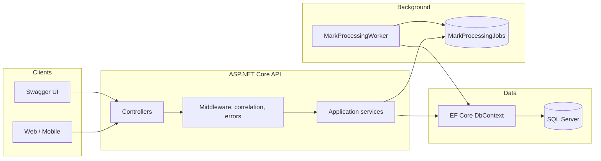
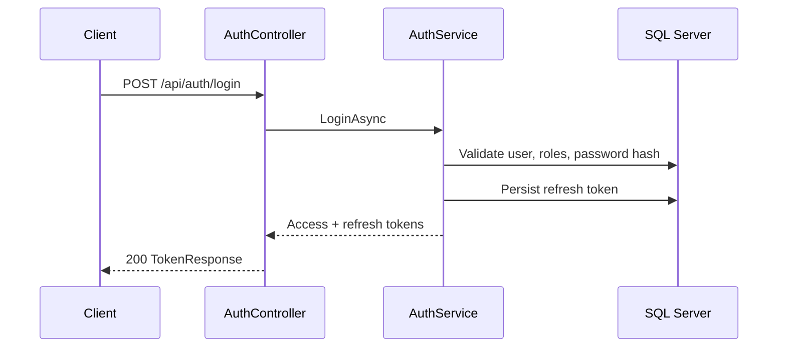
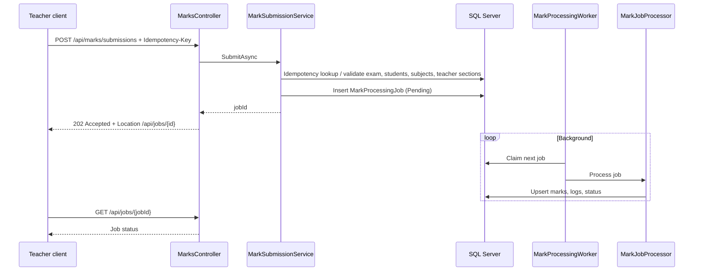

# System design

## 1. Purpose

The **School Assessment API** supports:

- Managing **academic structure** (classes → sections → students).
- **JWT-based authentication** with refresh tokens.
- **Role-based access** (Admin, Teacher, Student).
- **Marks entry** with **asynchronous processing**, **idempotency**, and **optimistic concurrency** on mark rows.
- **Rankings** per section or class for an exam.

---

## 2. High-level architecture

- **Synchronous path:** HTTP → middleware → controller → service → EF → SQL Server.
- **Marks path:** HTTP enqueues a **job row**; **`MarkProcessingWorker`** (hosted service) polls and applies marks in a controlled, retryable way.

---

## 3. Layering and modules

| Layer | Responsibility |
|-------|------------------|
| **Controllers** | HTTP routing, auth attributes, DTO mapping at the edge. |
| **Services** | Business rules, authorization checks (e.g. teacher must be assigned to section), orchestration. |
| **Validators** | FluentValidation for request bodies (e.g. submit marks). |
| **Models / EF** | Persistence entities and `SchoolAssessmentContext`. |
| **Middleware** | Correlation ID, global exception → Problem Details. |
| **Workers** | Long-running background loop for mark jobs. |
| **Processing** | `IMarkJobProcessor` implementation used by the worker. |

---

## 4. Key design decisions

| Decision | Rationale |
|----------|-----------|
| **JWT access + refresh tokens** | Stateless API suitable for SPAs and mobile; refresh allows rotation without re-login. |
| **Marks via async jobs** | Decouples HTTP latency from bulk writes; supports **retries** and **idempotency** on duplicate submits. |
| **`Idempotency-Key` header** on mark submission | Safe retries from clients; duplicate key returns the same job. |
| **`RowVersion` on `Mark`** | Optimistic concurrency if two updates race on the same logical mark. |
| **Separate `AppUsers` vs `Students`** | Login identity is not the same as enrollment; optional `Students.UserId` links student portal to an account. |
| **Teacher ↔ section via `TeacherSections`** | Fine-grained access: teachers only submit/view marks for students in assigned sections (unless Admin). |
| **Serilog + request logging** | Operational visibility and correlation with HTTP correlation IDs. |

---

## 5. Sequence: login

---

## 6. Sequence: submit marks (async)

---

## 7. Security model (summary)

- **Authentication:** Bearer JWT on protected routes; `AuthController` routes ignore a stale Authorization header by design so login is not broken.
- **Authorization:** ASP.NET Core policies via `[Authorize(Roles = ...)]` aligned with `AppRoles` (`Admin`, `Teacher`, `Student`).
- **Secrets:** `Jwt:SigningKey` must be configured (minimum length enforced at startup); not committed as a real production secret.

See [API-REFERENCE.md](./API-REFERENCE.md) for endpoint-level auth.

---

## 8. Cross-cutting concerns

- **Correlation ID:** attached to requests for log correlation.
- **Problem Details:** consistent error shape for API consumers.
- **Swagger / OpenAPI:** generated in Development for interactive exploration.

---

## 9. Related documents

- [DATA-MODEL.md](./DATA-MODEL.md) — tables and relationships.
- [API-REFERENCE.md](./API-REFERENCE.md) — routes and bodies.
- [ASSUMPTIONS-AND-LIMITATIONS.md](./ASSUMPTIONS-AND-LIMITATIONS.md) — scope boundaries.
